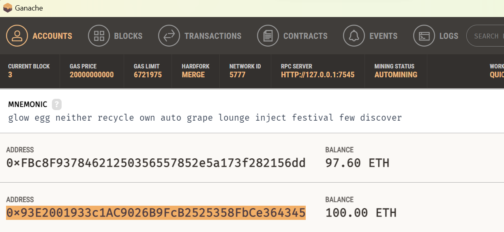
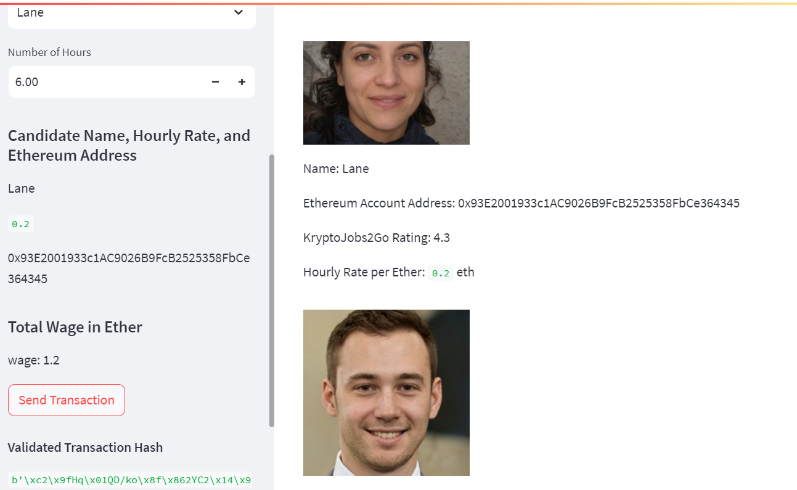
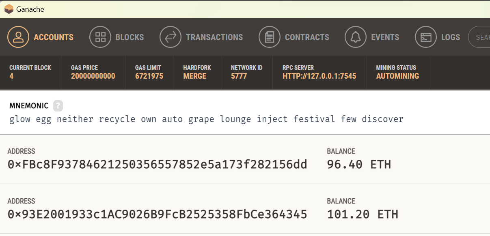
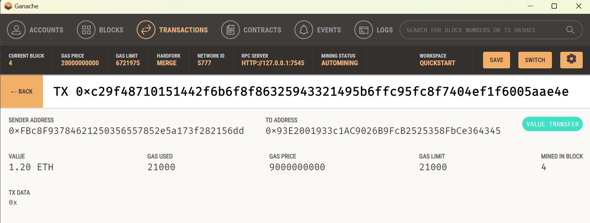

# homework-crypto-wallet

In this work we explore the way of using Ethereum crypto accounts to pay new hires. We use Ganache as the Ethereum back-end.

We start by creating an account using Ganache mnemonics so that it would be the first in the list, which has 100 ether.

Using Streamlit library we build a front-end screen, allowing select one of the 4 candidates listed.

Note that Lane's account address showes under her picture. The hourly rate showes on the sidebar after we select her. We then decide and input her working hours, and pay her by [Send Transaction] button. The payment is successful and the transaction hash is shown.

Behind the scene we paid Lane from our host account - the first one on the list at Ganache.

We can see the transaction detail at Ganache.

